# ComfyUI-Crystools [](https://hits.seeyoufarm.com) [](https://paypal.me/crystian77) <a src="https://colab.research.google.com/assets/colab-badge.svg" href="https://colab.research.google.com/drive/1xiTiPmZkcIqNOsLQPO1UNCdJZqgK3U5k?usp=sharing"></a>

**_🪛 A powerful set of tools for your belt when you work with ComfyUI 🪛_**

With this suit, you can see the resources monitor, progress bar & time elapsed, metadata and compare between two images, compare between two JSONs, show any value to console/display, pipes, and more!
This provides better nodes to load/save images, previews, etc, and see "hidden" data without loading a new workflow.


# Table of contents
- [General](#general)
- [Metadata](#metadata)
- [Debugger](#debugger)
- [Image](#image)
- [Pipe](#pipe)
- [Utils](#utils)
- [Primitives](#primitives)
- [List](#list)
- [Switch](#switch)
- Others: [About](#about), [To do](#to-do), [Changelog](#changelog), [Installation](#installation), [Use](#use)

---

## General

### Resources monitor

**🎉Finally, you can see the resources used by ComfyUI (CPU, GPU, RAM, VRAM, GPU Temp and space) on the menu in real-time!**

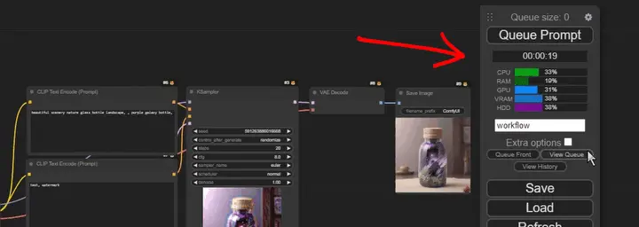

Now you can identify the bottlenecks in your workflow and know when it's time to restart the server, unload models or even close some tabs!

You can configure the refresh rate which resources to show:

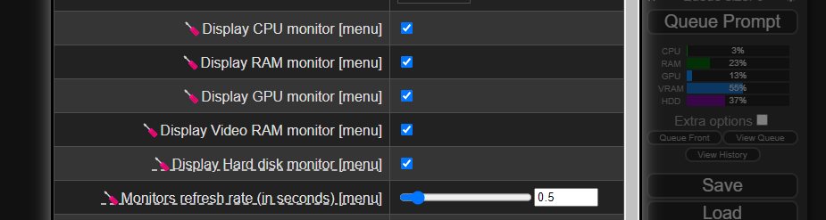

> **Notes:**
> - The GPU data is only available when you use CUDA (only NVIDIA cards, sorry AMD users).
> - This extension needs ComfyUI 1915 (or higher).
> - The cost of the monitor is low (0.1 to 0.5% of utilization), you can disable it from settings (`Refres rate` to `0`).
> - Data comes from these libraries:
>   - [psutil](https://pypi.org/project/psutil/)
>   - [torch](https://pytorch.org/)
>   - [pynvml](https://pypi.org/project/pynvml/) (official NVIDIA library)


### Progress bar

You can see the progress of your workflow with a progress bar on the menu!

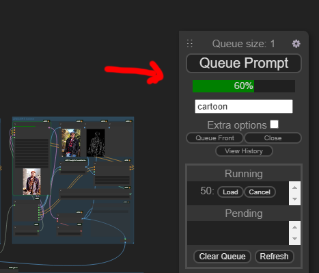

https://github.com/crystian/ComfyUI-Crystools/assets/3886806/35cc1257-2199-4b85-936e-2e31d892959c

Additionally, it shows the time elapsed at the end of the workflow, and you can `click` on it to see the **current working node.** 

> **Notes:**
> - If you don't want to see it, you can turn it off from settings (`Show progress bar in menu`)


## Metadata

### Node: Metadata extractor

This node is used to extract the metadata from the image and handle it as a JSON source for other nodes.  
You can see **all information**, even metadata from other sources (like Photoshop, see sample).

The input comes from the [load image with metadata](#node-load-image-with-metadata) or [preview from image](#node-preview-from-image) nodes (and others in the future).

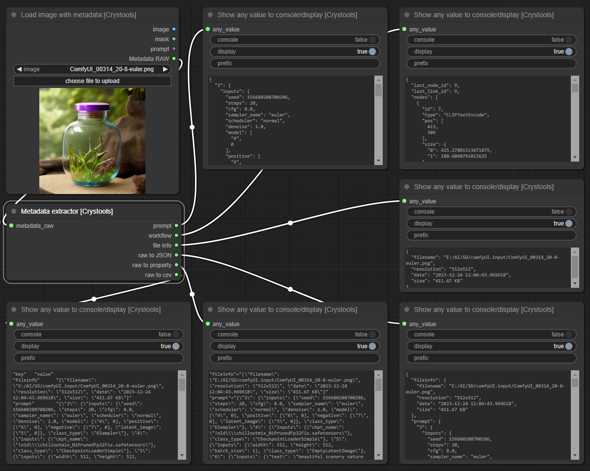

**Sample:** [metadata-extractor.json](./samples/metadata-extractor.json)

><details>
>  <summary>Other metadata sample (photoshop)</summary>
> 
> With metadata from Photoshop

></details>

><details>
>  <summary><i>Parameters</i></summary>
>
> - input: 
>   - metadata_raw: The metadata raw from the image or preview node
> - Output:
>   - prompt: The prompt used to produce the image.
>   - workflow: The workflow used to produce the image (all information about nodes, values, etc).
>   - file info: The file info of the image/metadata (resolution, size, etc) is human readable.
>   - raw to JSON: The entire metadata is raw but formatted/readable.
>   - raw to property: The entire metadata is raw in "properties" format.
>   - raw to csv: The entire metadata is raw in "csv" format.
></details>

<br />

### Node: Metadata comparator

This node is so useful for comparing two metadata and seeing the differences (**the main reason why I created this extension!**)

You can compare 3 inputs: "Prompt", "Workflow" and "Fileinfo"

There are three potential "outputs": `values_changed`, `dictionary_item_added`, and `dictionary_item_removed` (in this order of priority).

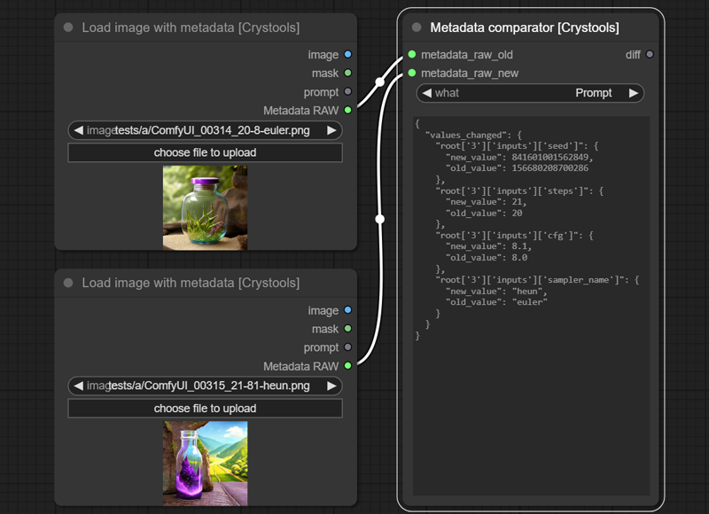

**Sample:** [metadata-comparator.json](./samples/metadata-comparator.json)

**Notes:**  
- I use [DeepDiff](https://pypi.org/project/deepdiff) for that. For more info check the link.  
- If you want to compare two JSONs, you can use the [JSON comparator](#node-JSON-comparator) node.


><details>
>  <summary><i>Parameters</i></summary>
>
> - options:
>   - what: What to compare, you can choose between "Prompt", "Workflow" and "Fileinfo"  
> - input: 
>   - metadata_raw_old: The metadata raw to start comparing
>   - metadata_raw_new: The metadata raw to compare
> - Output:
> - diff: This is the same output you can see in the display of the node; you can use it on other nodes.
></details>

<br />

---

## Debugger

### Node: Show Metadata

With this node, you will be able to see the JSON produced from your entire prompt and workflow so that you can know all the values (and more) of your prompt quickly without opening the file (PNG or JSON).

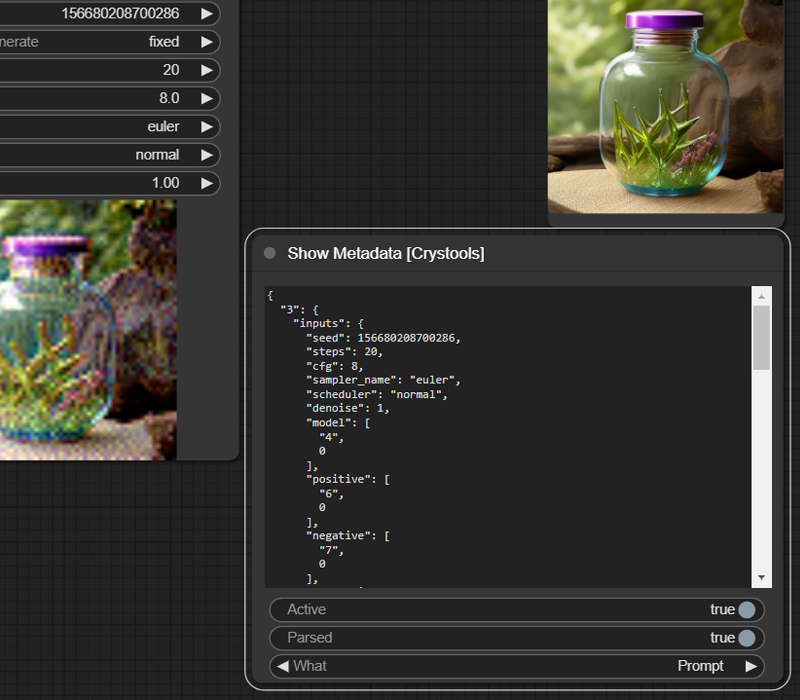

**Sample:** [debugger-metadata.json](./samples/debugger-metadata.json)

><details>
>  <summary><i>Parameters</i></summary>
>
> - Options:
>   - Active: Enable/disable the node  
>   - Parsed: Show the parsed JSON or plain text  
>   - What: Show the prompt or workflow (prompt are values to produce the image, and workflow is the entire workflow of ComfyUI)
></details>

<br /> 

### Node: Show any

You can see on the console or display any text or data from the nodes. Connect it to what you want to inspect, and you will see it.


**Sample:** [debugger-any.json](./samples/debugger-any.json)

><details>
>  <summary><i>Parameters</i></summary>
>
> - Input:
>   - any_value: Any value to show, which can be a string, number, etc.
> - Options:
>   - Console: Enable/disable write to console  
>   - Display: Enable/disable write on this node  
>   - Prefix: Prefix to console
></details>

<br />

### Node: Show any to JSON

It is the same as the previous one, but it formatted the value to JSON (only display).

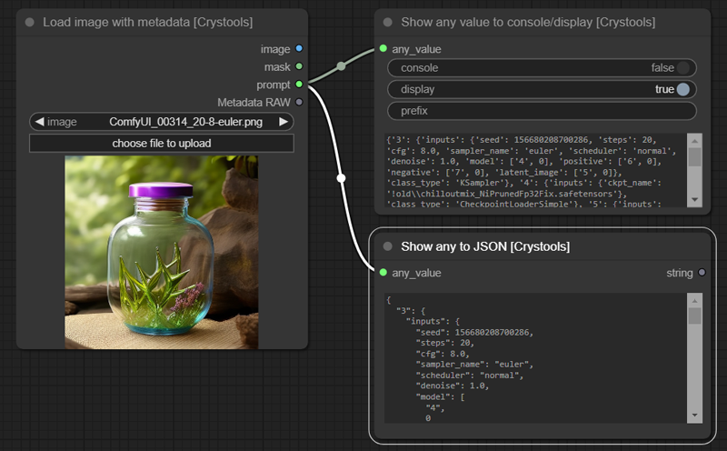

**Sample:** [debugger-json.json](./samples/debugger-json.json)

><details>
>  <summary><i>Parameters</i></summary>
>
> - Input:
>   - any_value: Any value to try to convert to JSON
> - Output:
>   - string: The same string is shown on the display
></details>

<br />

---

## Image

### Node: Load image with metadata
This node is the same as the default one, but it adds three features: Prompt, Metadata, and supports **subfolders** of the "input" folder.

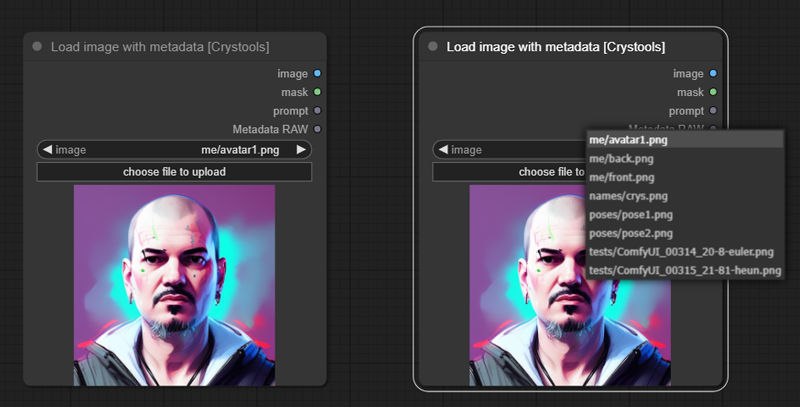

**Sample:** [image-load.json](./samples/image-load.json)

><details>
>  <summary><i>Parameters</i></summary>
>
> - Input:
>   - image: Read the images from the input folder (and subfolder) (you can drop the image here or even paste an image from the clipboard)
> - Output:
>   - Image/Mask: The same as the default node  
>   - Prompt: The prompt used to produce the image (not the workflow)  
>   - Metadata RAW: The metadata raw of the image (full workflow) as string
></details>

**Note:** The subfolders support inspired on: [comfyui-imagesubfolders](https://github.com/catscandrive/comfyui-imagesubfolders)

<br />

### Node: Save image with extra metadata
This node is the same as the default one, but it adds two features: Save the workflow in the png or not, and you can add any piece of metadata (as JSON).

This saves custom data on the image, so you can share it with others, and they can see the workflow and metadata (see [preview from metadata](#node-preview-from-metadata)), even your custom data.

It can be any type of information that supports text and JSON.

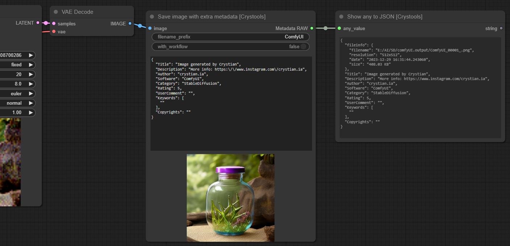

**Sample:** [image-save.json](./samples/image-save.json)

><details>
>  <summary><i>Parameters</i></summary>
>
> - options:
>   - with_workflow: If you want to save into the image workflow (special to share the workflow with others)
> - Input:
>   - image: The image to save (same as the default node)
> - Output:
>   - Metadata RAW: The metadata raw of the image (full workflow) as string
></details>

**Note:** The data is saved as special "exif" (as ComfyUI does) in the png file; you can read it with [Load image with metadata](#node-load-image-with-metadata).

> **Important:**
> - If you want to save your workflow with a particular name and your data as creator, you need to use the [ComfyUI-Crystools-save](https://github.com/crystian/ComfyUI-Crystools-save) extension; try it!
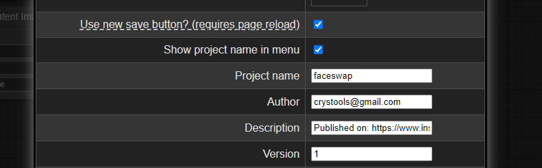


<br />

### Node: Preview from image

This node is used to preview the image with the **current prompt** and additional features.  

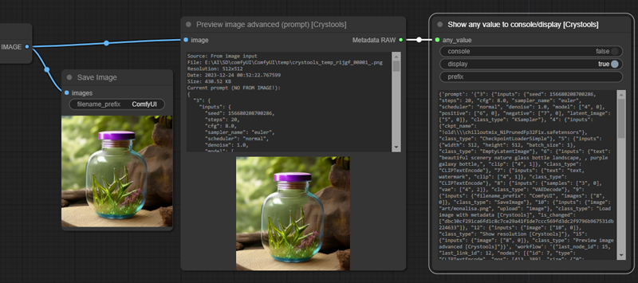

**Feature:** It supports cache (shows as "CACHED") (not permanent yet!), so you can disconnect the node and still see the image and data, so you can use it to compare with others!

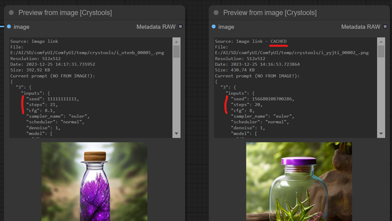

As you can see the seed, steps, and cfg were changed

**Sample:** [image-preview-image.json](./samples/image-preview-image.json)

><details>
>  <summary><i>Parameters</i></summary>
>
> - Input:
>   - image: Any kind of image link
> - Output:
>   - Metadata RAW: The metadata raw of the image and full workflow.  
>     - You can use it to **compare with others** (see [metadata comparator](#node-metadata-comparator))
>     - The file info like filename, resolution, datetime and size with **the current prompt, not the original one!** (see important note)
></details>

> **Important:**
> - If you want to read the metadata of the image, you need to use the [load image with metadata](#node-load-image-with-metadata) and use the output "metadata RAW" not the image link.
> - To do a preview, it is necessary to save it first on the temporal folder, and the data shown is from the temporal image, **not the original one** even **the prompt!**

<br />

### Node: Preview from metadata

This node is used to preview the image from the metadata and shows additional data (all around this one).  
It supports the same features as [preview from image](#node-preview-from-image) (cache, metadata raw, etc.). But the important difference is you see **real data from the image** (not the temporal one or the current prompt).
 
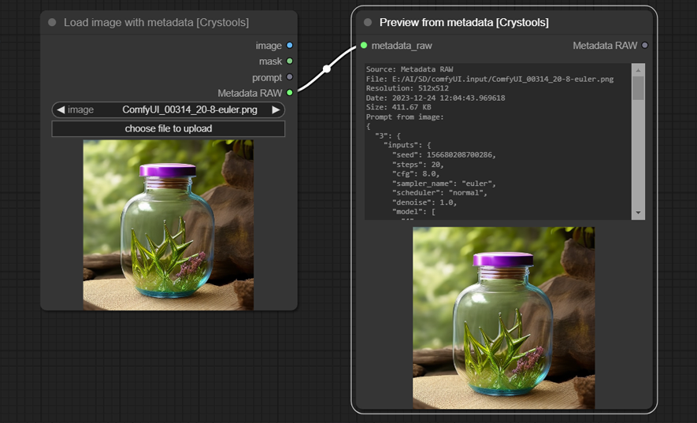

**Sample:** [image-preview-metadata.json](./samples/image-preview-metadata.json)

<br />

### Node: Show resolution

This node is used to show the resolution of an image.

> Can be used with any image link.

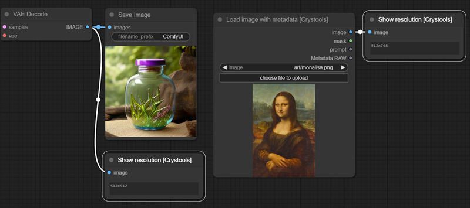

**Sample:** [image-resolution.json](./samples/image-resolution.json)

><details>
>  <summary><i>Parameters</i></summary>
>
> - Input:
>   - image: Any kind of image link
> - Output:
>   - Width: The width of the image  
>   - Height: The height of the image
></details>

<br />

---

## Pipe

### Nodes: Pipe to/edit any, Pipe from any

This powerful set of nodes is used to better organize your pipes.  

The "Pipe to/edit any" node is used to encapsulate multiple links into a single one. It includes support for editing and easily adding the modified content back to the same pipe number.

The "Pipe from any" node is used to extract the content of a pipe.  
 
Typical example:

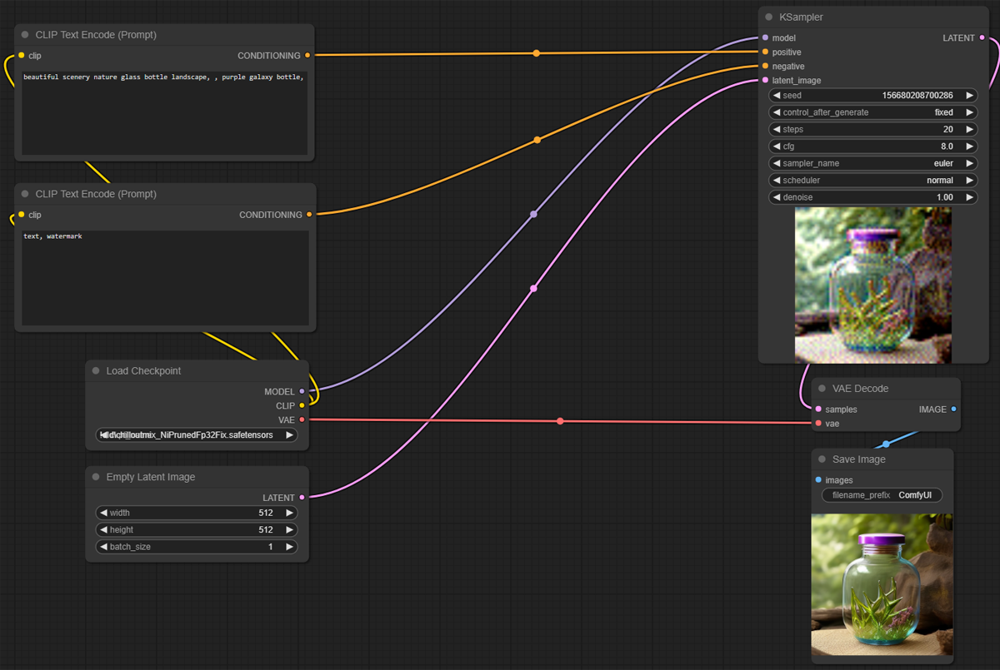

With pipes:

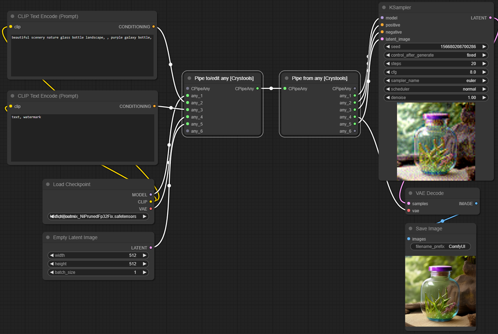

**Sample:** [pipe-1.json](./samples/pipe-1.json)

Editing pipes:

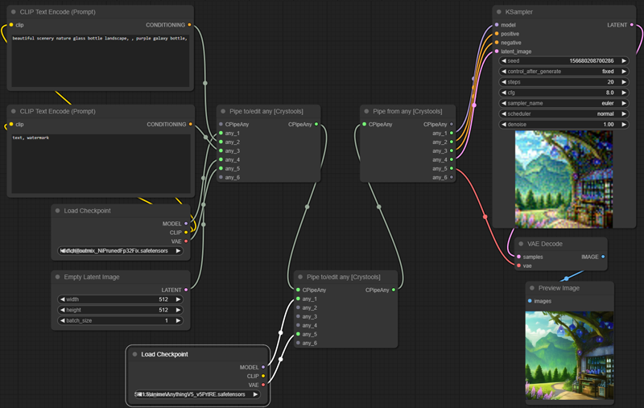

**Sample:** [pipe-2.json](./samples/pipe-2.json)

><details>
>  <summary><i>Parameters</i></summary>
>
> - Input:
>   - CPipeAny: This is the type of this pipe you can use to edit (see the sample)
>   - any_*: 6 possible inputs to use
> - Output:
>   - CPipeAny: You can continue the pipe with this output; you can use it to bifurcate the pipe (see the sample)
></details>

>**Important:**
> - Please note that it supports "any," meaning it does not validate (not yet!) the correspondence of input nodes with the output ones. When creating the link, it is recommended to link consciously number by number.
> - "RecursionError" It's crucial to note that the flow of links **must be in the same direction**, and they cannot be mixed with other flows that use the result of this one. Otherwise, this may lead to recursion and block the server (you need to restart it!)


><details>
>  <summary><i>Bad example with "RecursionError: maximum recursion depth exceeded"</i></summary>
>
> If you see something like this on your console, you need to check your pipes. That is bad sample of pipes, you can't mix the flows.
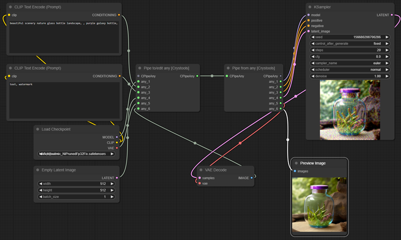
></details>

<br />

---

## Utils

Some useful nodes to use in your workflow.

### Node: JSON comparator

This node is so useful to compare two JSONs and see the differences.

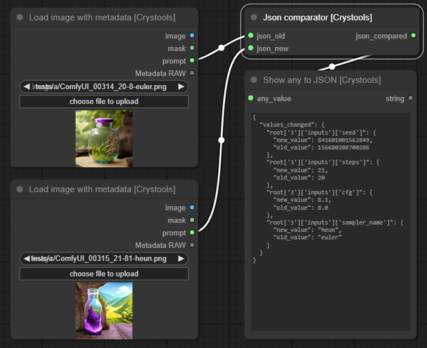

**Sample:** [utils-json-comparator.json](./samples/utils-json-comparator.json)


><details>
>  <summary><i>Parameters</i></summary>
>
> - input: 
>   - json_old: The first JSON to start compare
>   - json_new: The JSON to compare
> - Output:
>   - diff: A new JSON with the differences
></details>


**Notes:**  
As you can see, it is the same as the [metadata comparator](#node-metadata-comparator) but with JSONs.  
The other is intentionally simple to compare two images metadata; this is more generic.  
The main difference is that you can compare any JSON, not only metadata.

<br />

### Node: Stats system

This node is used to show the system stats (RAM, VRAM, and Space).  
It **should** connect as a pipe.

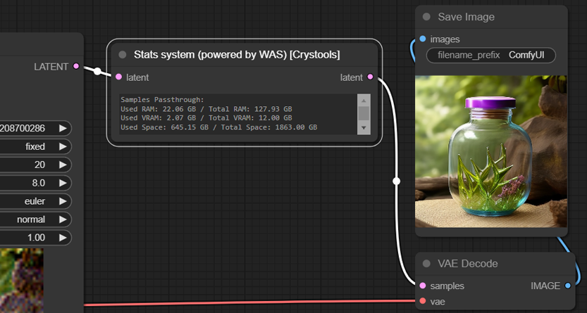

**Sample:** [utils-stats.json](./samples/utils-stats.json)

><details>
>  <summary><i>Parameters</i></summary>
>
> - input: 
>   - latent: The latent to use to measure the stats
> - Output:
>   - latent: Return the same latent to continue the pipe
></details>

**Notes:** The original is in [WAS](https://github.com/WASasquatch/was-node-suite-comfyui), I only show it on the display.

<br />

---

## Primitives

### Nodes: Primitive boolean, Primitive integer, Primitive float, Primitive string, Primitive string multiline

A set of nodes with primitive values to use in your prompts.

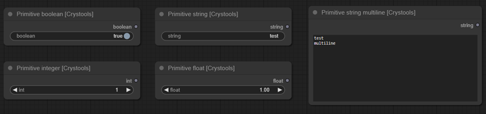

<br />

---

## List
A set of nodes with a list of values (any or strings/texts) for any proposal (news nodes to use it coming soon!).

> **Important:** You can use other nodes like "Show any" to see the values of the list

### Node: List of strings

**Feature:** You can concatenate them.

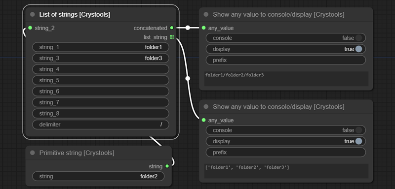

**Sample:** [list-strings.json](./samples/list-strings.json)

><details>
>  <summary><i>Parameters</i></summary>
>
> - Input:
>   - string_*: 8 possible inputs to use
>   - delimiter: Use to concatenate the values on the output
> - Output:
>   - concatenated: A string with all values concatenated
>   - list_string: The list of strings (only with values)
></details>

<br />

### Node: List of any

You can concatenate any value (it will try to convert it to a string and show the value), so it is util to see several values at the same time.

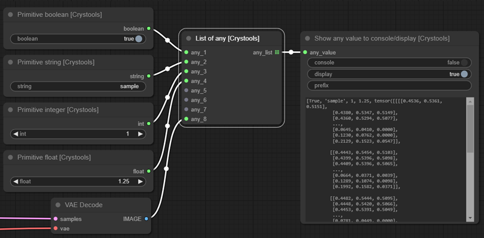

**Sample:** [list-any.json](./samples/list-any.json)

><details>
>  <summary><i>Parameters</i></summary>
>
> - Input:
>   - any_*: 8 possible inputs to use
> - Output:
>   - list_any: The list of any elements (only with values)
></details>

<br />

---

## Switch
A set of nodes to switch between flows.  

All switches are boolean; you can switch between flows by simply changing the value of the switch.  
You have predefined switches (string, latent, image, conditioning) but you can use "Switch any" for any value/type.

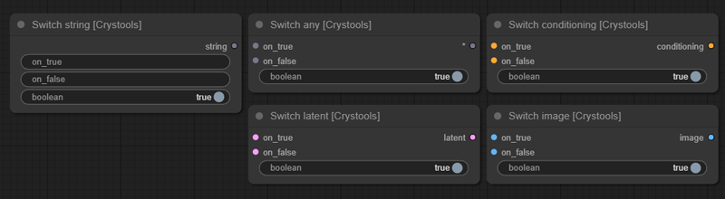

**Sample:** [switch.json](./samples/switch.json)

<br />

---

## About

**Notes from the author:**
- This is my first project in python ¯\\_(ツ)_/¯ (PR are welcome!)
- I'm a software engineer but in other languages (web technologies)
- My Instagram is: https://www.instagram.com/crystian.ia I'll publish my works on it, so consider following me for news! :)
- I'm not a native English speaker, so sorry for my English :P

---

## To do
- [ ] Several unit tests
- [ ] Add permanent cache for preview/metadata image (to survive to F5! or restart the server)

---

## Changelog

### Crystools

### 1.16.0 (31/07/2024)
- Rollback of AMD support by manager does not support other repository parameter (https://test.pypi.org/simple by pyrsmi)

### 1.15.0 (21/07/2024)
- AMD Branch merged to the main branch, should work for AMD users on **Linux**

### 1.14.0 (15/07/2024)
- Tried to use AMD info, but it breaks installation on windows, so I removed it ¯\_(ツ)_/¯
- AMD Branch added, if you use AMD and Linux, you can try it (not tested for me)

### 1.13.0 (01/07/2024)
- Integrate with new ecosystem of ComfyUI
- Webp support added on load image with metadata node

### 1.12.0 (27/03/2024)
- GPU Temperature added

### 1.10.0 (17/01/2024)
- Multi-gpu added

### 1.9.2 (15/01/2024)
- Big refactor on hardwareInfo and monitor.ts, gpu was separated on another file, preparing for multi-gpu support

### 1.8.0 (14/01/2024) - internal
- HDD monitor selector on settings

### 1.7.0 (11/01/2024) - internal
- Typescript added!

### 1.6.0 (11/01/2024)
- Fix issue [#7](https://github.com/crystian/ComfyUI-Crystools/issues/7) to the thread deadlock on concurrency

### 1.5.0 (10/01/2024)
- Improvements on the resources monitor and how handle the threads
- Some fixes 

### 1.3.0 (08/01/2024)
- Added in general Resources monitor (CPU, GPU, RAM, VRAM, and space)
- Added this icon to identify this set of tools: 🪛 

### 1.2.0 (05/01/2024)
- progress bar added
 
### 1.1.0 (29/12/2023)
- Node added: "Save image with extra metadata"
- Support to **read** Jpeg metadata added (not save)

### 1.0.0 (26/12/2023)
- First release


### Crystools-save

### 1.1.0 (07/01/2024)
- Labeling updated according to the new version of Crystools (this project)

### 1.0.0 (29/12/2023)
- Created another extension to save the info about the author on workflow: [ComfyUI-Crystools-save](https://github.com/crystian/ComfyUI-Crystools-save)

---

## Installation

### Install from GitHub
1. Install [ComfyUi](https://github.com/comfyanonymous/ComfyUI).
2. Clone this repo into `custom_modules`:
    ```
    cd ComfyUI/custom_nodes
    git clone https://github.com/crystian/ComfyUI-Crystools.git
    cd ComfyUI-Crystools
    pip install -r requirements.txt
    ```
3. Start up ComfyUI.

#### For AMD users
If you are an AMD user with Linux, you can try the AMD branch:

**ATTENTION:** Don't install with the manager, you need to install manually:

  ```
  cd ComfyUI/custom_nodes
  git clone -b AMD https://github.com/crystian/ComfyUI-Crystools.git
  cd ComfyUI-Crystools
  pip install -r requirements.txt
  ```

### Install from manager

Search for `crystools` in the [manager](https://github.com/ltdrdata/ComfyUI-Manager.git) and install it.

### Using on Google Colab

You can use it on Google Colab, but you need to install it manually:

[Google Colab](https://colab.research.google.com/drive/1xiTiPmZkcIqNOsLQPO1UNCdJZqgK3U5k?usp=sharing)

* Run the first cell to install ComfyUI and launch the server
* After it finishes, use the link to open the a new tab, looking a line like this:
```
This is the URL to access ComfyUI: https://identifying-complications-fw-some.trycloudflare.com    
```

---

## Use

You can use it as any other node, just using the menu in the category `crystools` or double clicking on the canvas (I recommended using the "oo" to fast filter), all nodes were post fixing with `[Crystools]`.

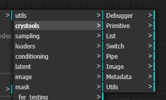


If for some reason you need to see the logs, you can define the environment variable `CRYSTOOLS_LOGLEVEL` and set the [value](https://docs.python.org/es/3/howto/logging.html).

---

Made with ❤️ by Crystian.
