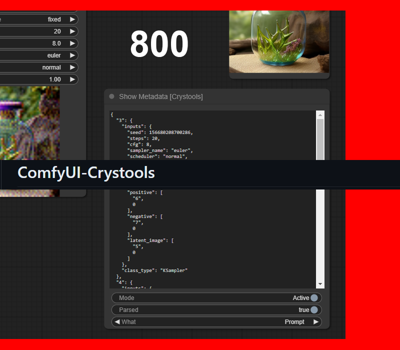

# ComfyUI-Crystools

**_A powerful set of tools for your belt when you work with ComfyUI_**

## Debugger
### Show Metadata

Do you need to see the complete prompt? or even the entire workflow?  
-No problem, just connect the output of the prompt or workflow to the input of this node and you will see the complete JSON.

><details>
>    <summary>ℹ️ <i>More Information</i></summary>
>
>    With this node, you will be able to see the JSON produced from your entire prompt and workflow so that you can really know all the values (and more) of your prompt quickly without the need to open the file (PNG or JSON).
>
>    
> 
>    
></details>


### Show any value to console/display

## Primitives
### Primitive boolean
### Primitive integer
### Primitive float
### Primitive string
### Primitive string multiline

## List
### List of strings
### List of any

## Switch
### Switch any
### Switch latent
### Switch conditioning
### Switch image
### Switch string

## Pipe
### Pipe to/edit any
### Pipe from any

## Image
### Load image with metadata
### Show resolution
### Preview image advanced (prompt)

## Utils
### Metadata extractor
### Metadata comparator
### Json comparator
### Stat system

More info and works:
ig

buscar con oo

## Installation

### Install from GitHub
1. Install [ComfyUi](https://github.com/comfyanonymous/ComfyUI).
2. Clone this repo into `custom_modules`:
    ```
    cd ComfyUI/custom_nodes
    git clone https://github.com/crystian/ComfyUI-Crystools.git
    ```
3. Start up ComfyUI.

### Install from manager

Search for `crystools` in the [manager](https://github.com/ltdrdata/ComfyUI-Manager.git) and install it.


