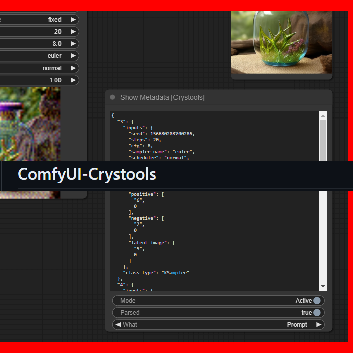
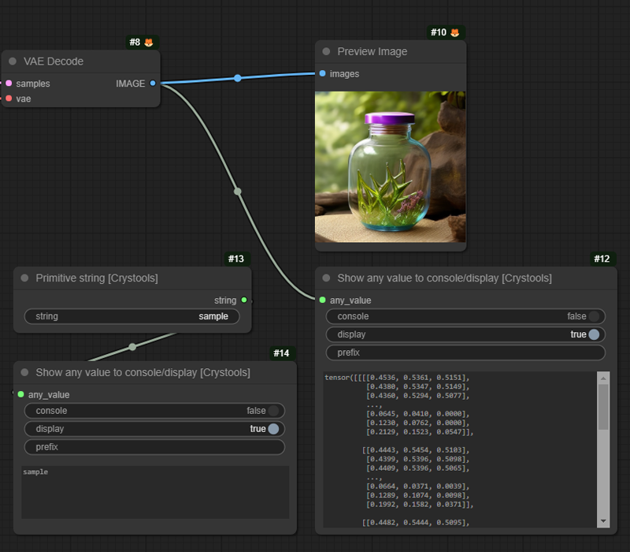

# ComfyUI-Crystools

**_A powerful set of tools/nodes for your belt when you work with ComfyUI_**

Show metadata, compare between two JSONs, compare between two images, show any value to console/display, pipes, and more!


## Debugger
### Show Metadata

> With this node, you will be able to see the JSON produced from your entire prompt and workflow so that you can really know all the values (and more) of your prompt quickly without the need to open the file (PNG or JSON).



><details>
>  <summary><i>Options</i></summary>
>
>  - Active: Enable/disable the node  
>  - Parsed: Show the parsed JSON or plain text  
>  - What: Show the prompt or workflow (prompt are values to produce the image, and workflow is the entire workflow of ComfyUI)
></details>

### Show any value to console/display

> With this node, you can practically see any text or data from the nodes. Connect it to what you want to inspect, and you will see it.



><details>
>  <summary><i>Options</i></summary>
>
>  - Console: Enable/disable write to console  
>  - Display: Enable/disable write on this node  
>  - Prefix: Prefix to console
></details>


## Primitives
### Primitive boolean
### Primitive integer
### Primitive float
### Primitive string
### Primitive string multiline

## List
### List of strings
### List of any

## Switch
### Switch any
### Switch latent
### Switch conditioning
### Switch image
### Switch string

## Pipe
### Pipe to/edit any
### Pipe from any

## Image
### Load image with metadata
### Show resolution
### Preview image advanced (prompt)

## Utils
### Metadata extractor
### Metadata comparator
### Json comparator
### Stat system

More info and works:
ig

buscar con oo

primerp pryecto en python

todo
test
persistir imagen

agregar desde menu o doble click

## Installation


### Install from GitHub
1. Install [ComfyUi](https://github.com/comfyanonymous/ComfyUI).
2. Clone this repo into `custom_modules`:
    ```
    cd ComfyUI/custom_nodes
    git clone https://github.com/crystian/ComfyUI-Crystools.git
    ```
3. Start up ComfyUI.

### Install from manager

Search for `crystools` in the [manager](https://github.com/ltdrdata/ComfyUI-Manager.git) and install it.


