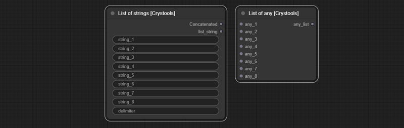
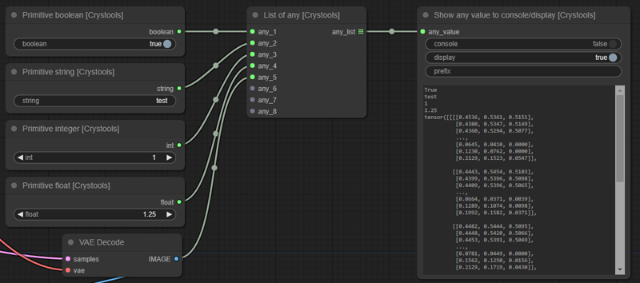

# ComfyUI-Crystools

**_A powerful set of tools/nodes for your belt when you work with ComfyUI_**

Show metadata, compare between two JSONs, compare between two images, show any value to console/display, pipes, and more!


## Debugger
### Node: Show Metadata

With this node, you will be able to see the JSON produced from your entire prompt and workflow so that you can really know all the values (and more) of your prompt quickly without the need to open the file (PNG or JSON).


><details>
>  <summary><i>Options</i></summary>
>
>  - Active: Enable/disable the node  
>  - Parsed: Show the parsed JSON or plain text  
>  - What: Show the prompt or workflow (prompt are values to produce the image, and workflow is the entire workflow of ComfyUI)
></details>

### Node: Show any value to console/display

With this node, you can practically see any text or data from the nodes. Connect it to what you want to inspect, and you will see it.


><details>
>  <summary><i>Options</i></summary>
>
>  - Console: Enable/disable write to console  
>  - Display: Enable/disable write on this node  
>  - Prefix: Prefix to console
></details>


## Primitives
### Nodes: Primitive boolean, Primitive integer, Primitive float, Primitive string, Primitive string multiline

A set of nodes with primitive values to use in your prompts.


## List
### Nodes: List of strings, List of any

A set of nodes with list of values (any or strings/texts)  
With strings you can concatenate them  



> **Important:** You can use with others nodes like "Show any" to see the values of the list



## Switch
A set of nodes to switch between flows.  
All switches are boolean, you can switch between flows by simply changing the value of the switch.  
You have predefined switches (string, latent, image, conditioning) but you can use "Switch any" for any value/type.


## Pipe
### Nodes: Pipe to/edit any, Pipe from any
This powerful set of nodes is used to better organize your pipes.  
The "Pipe to/edit any" node is used to encapsulate multiple links into a single one. It includes support for editing, easily adding the modified content back to the same pipe number.   
The "Pipe from any" node is used to extract the content of a pipe.  
A maximum of 6 **optional** links is supported.

>**Important:**
>- Please note that it supports "any," meaning it does not validate (not yet!) the correspondence of input nodes with the output ones. When creating the link, it is recommended to link consciously number by number.
>- "RecursionError", It's crucial to note that the flow of links **must be in the same direction**, and they cannot be mixed with other flows that use the result of this one. Otherwise, this may lead to recursion and block the server (you need to restart it!)
 
Typical example:


With pipes:


Editing pipes:


Bad example with "RecursionError: maximum recursion depth exceeded":


## Image
### Load image with metadata
This node is the same as the default one, but it adds three options: Prompt, Metadata, and subfolders of the "input" folder.


><details>
>  <summary><i>Outputs</i></summary>
>
>  - Image/Mask: The same as the default node  
>  - Prompt: The prompt used to produce the image (not the workflow)  
>  - Metadata RAW: The metadata raw of the image (full workflow) as string
></details>

The subfolders support is by: [comfyui-imagesubfolders](https://github.com/catscandrive/comfyui-imagesubfolders)

### Show resolution
This node is used to show the resolution of the image.

> Can be used with any image link.


### Preview image advanced (prompt)
This node is used to preview the image with the current prompt and additional data.  

- Additional feature: This node has an output as metadata raw, **you can use to compare with others!** (see below)
- Additional data: Shows the filename, resolution, datetime and size with **the current prompt**


> Important:
> - If you want to read the metadata of the image, you need to use the "Load image with metadata" node and output "metadata RAW".
> - To do a preview it is necessary save it first on temporal folder, and the data shown is from the temporal image, not the original one.

 
## Utils
### Metadata extractor
### Metadata comparator
### Json comparator
### Stat system

More info and works:
ig

buscar con oo

primerp pryecto en python

todo
test
persistir imagen

agregar desde menu o doble click

## Installation


### Install from GitHub
1. Install [ComfyUi](https://github.com/comfyanonymous/ComfyUI).
2. Clone this repo into `custom_modules`:
    ```
    cd ComfyUI/custom_nodes
    git clone https://github.com/crystian/ComfyUI-Crystools.git
    ```
3. Start up ComfyUI.

### Install from manager

Search for `crystools` in the [manager](https://github.com/ltdrdata/ComfyUI-Manager.git) and install it.


